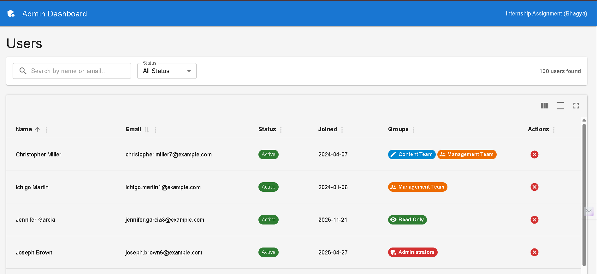
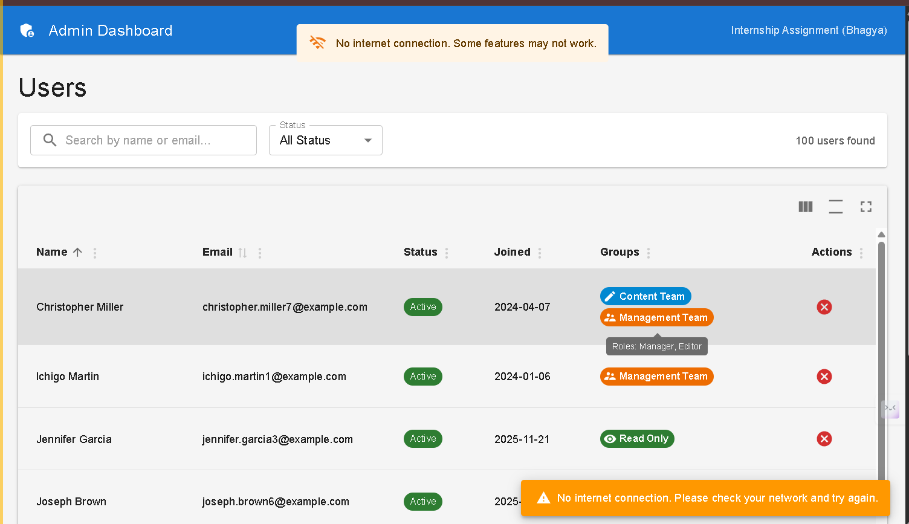
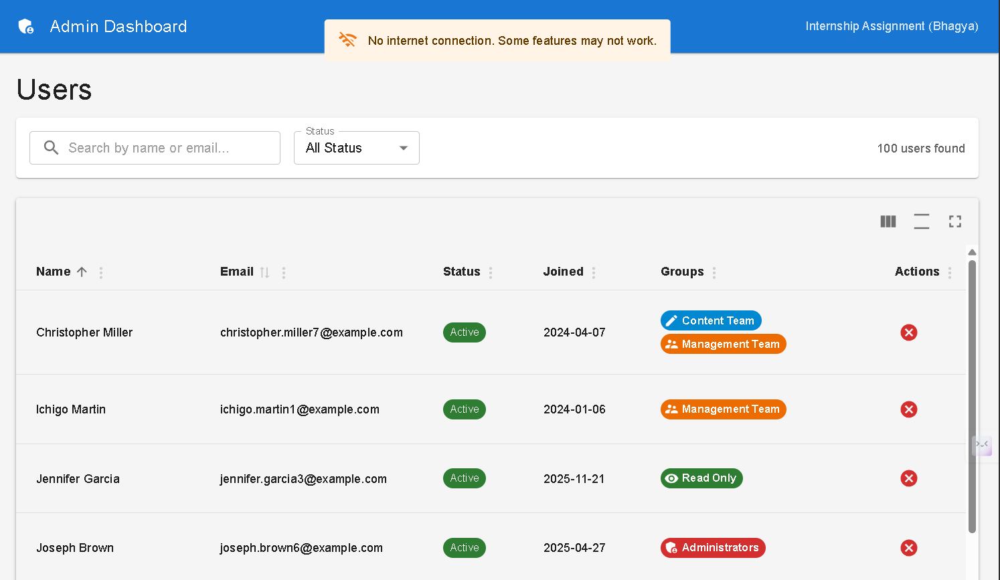

# Admin Dashboard - Internship Assignment

A pre-built admin dashboard with **intentional bugs** and **incomplete features** for you to fix and complete.

## Live Demo

**[View Live Demo](https://vegam-solutions-assignment.vercel.app)**

## Quick Start

```bash
# Install dependencies
npm install

# Initialize MSW (required for mock API)
npx msw init public --save

# Start development server
npm run dev

# Run tests
npm test
```

The app will be available at http://localhost:5173

## Tech Stack

| Technology | Purpose |
|------------|---------|
| React 18 | UI Framework |
| TypeScript | Type Safety (strict mode) |
| Material React Table (MRT) | Data Grid |
| Material UI | Component Library |
| React Query | Data Fetching & Caching |
| MSW | Mock API |
| React Router v6 | Routing |
| Notistack | Toast Notifications |
| Vitest | Unit Testing |

## Project Structure

```
src/
├── api/                  # API calls
├── components/
│   └── tables/           # Table components (DynamicGrid, UserActions)
├── hooks/                # Custom hooks (useUsers, useDebounce)
├── layouts/              # Page layouts
├── mocks/                # MSW mock handlers
├── pages/
│   └── UsersPage/        # Users page
├── types/                # TypeScript types
├── utils/                # Utilities & column config
├── App.tsx
├── main.tsx
└── routes.tsx
```

---

## Changes Made

### Part 1: Bug Fixes (Required) ✅

1. **Bug #1: Cache Invalidation** - Fixed table not refreshing after status update by adding `queryClient.invalidateQueries()` in `onSettled` callback (`src/hooks/useUsers.ts`)

2. **Bug #2: Groups Column** - Fixed chiplist renderer to display `group.groupName` instead of `[object Object]` (`src/components/tables/DynamicGrid.tsx`)

3. **Bug #3: URL Sync** - Pagination, filters, and search now sync with URL params. Page persists on refresh using `useRef` to prevent reset on mount (`src/pages/UsersPage/UsersPage.tsx`)

### Part 2: Complete Features (Required) ✅

1. **Debounced Search** - Added 300ms debounce using `useDebounce` hook to prevent API calls on every keystroke (`src/hooks/useDebounce.ts`)

2. **Loading Skeleton** - Added `TableSkeleton` component showing placeholder rows matching table structure (`src/components/tables/DynamicGrid.tsx`)

3. **Optimistic UI** - Immediate UI update on status toggle with automatic rollback on error using `onMutate`/`onError` callbacks (`src/hooks/useUsers.ts`)

### Part 3: New Features (Required) ✅

1. **Enhanced Actions** - Added confirmation dialog before deactivating, hover states with scale animation, keyboard navigation, proper ARIA labels (`src/components/tables/UserActions.tsx`)

2. **Error Handling** - Added ErrorBoundary component, offline detection with `useNetworkStatus` hook, user-friendly error messages, retry functionality, OfflineBanner component (`src/components/ErrorBoundary.tsx`, `src/hooks/useNetworkStatus.ts`)

### Bonus Features (Optional) ✅

1. **Bonus A: localStorage Persistence** - Column visibility, sorting, and density preferences saved per table (`src/hooks/useLocalStorage.ts`)

2. **Bonus B: Unit Tests** - 23 tests passing for `useDebounce` hook (7 tests) and `DynamicGrid` component (16 tests) (`src/hooks/useDebounce.test.ts`, `src/components/tables/DynamicGrid.test.tsx`)

3. **Bonus C: Role-Based UI** - Visual indicators with colored badges and icons for all user groups:
   - Administrators (Red + Shield icon)
   - Management Team (Orange + Supervisor icon)
   - Content Team (Blue + Edit icon)
   - Standard Users (Purple + Person icon)
   - Read Only (Green + Eye icon)

---

## Submission Checklist

- [x] All 3 bugs fixed
- [x] Debounced search working
- [x] Loading skeleton added
- [x] Optimistic UI implemented
- [x] Error handling improved
- [x] Separate git commits for each fix/feature
- [x] README updated with changes
- [x] Deployed to Vercel
- [x] (Bonus) localStorage persistence
- [x] (Bonus) Unit tests (23 tests)
- [x] (Bonus) Role-based UI with icons

---

## Screenshots

| Dashboard (Users Page) | User Actions |
|:---:|:---:|
|  |  |
| *Main User Grid with Search & Filters* | *Active/Inactive Status Toggle with Confirmation* |

| Offline Detection | Offline Error Message |
|:---:|:---:|
|  |  |
| *Banner when user goes offline* | *Full page error with retry option* |
